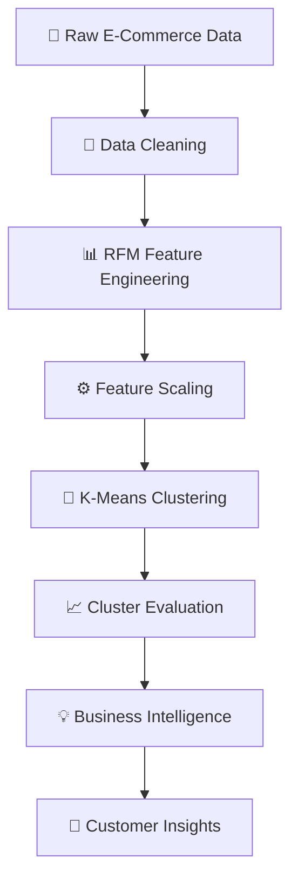
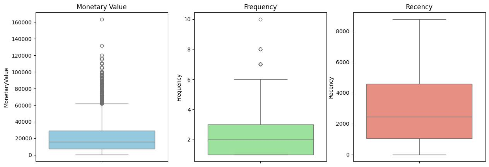
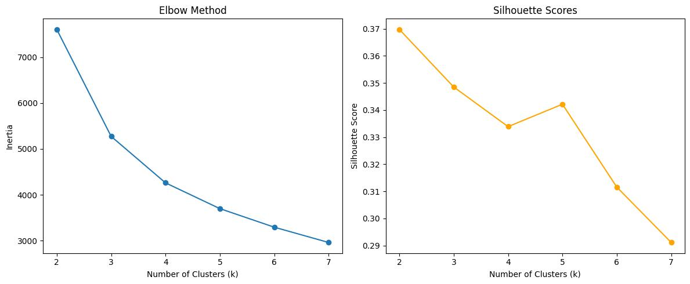
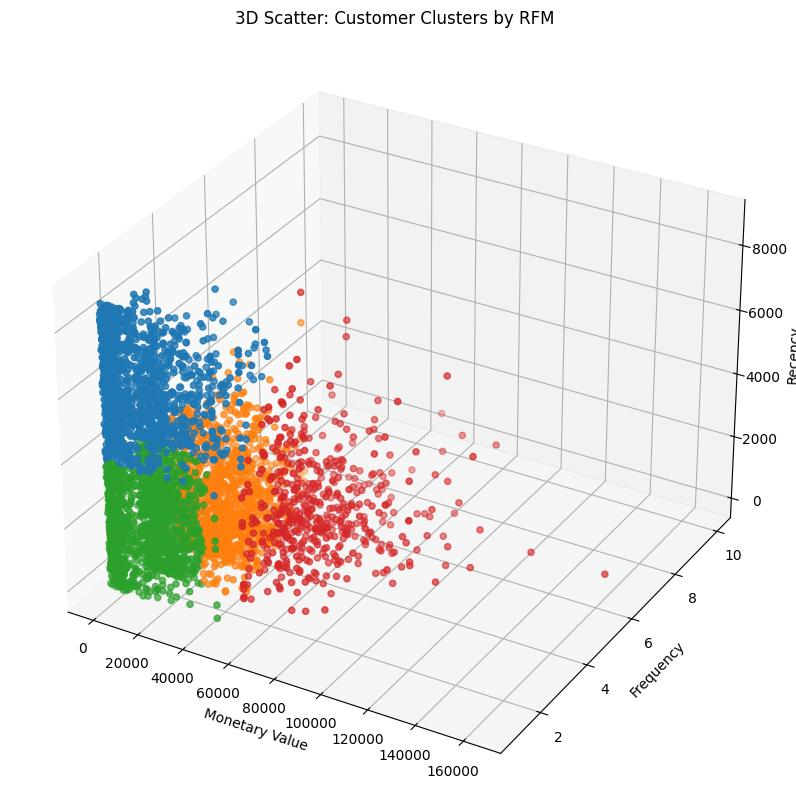
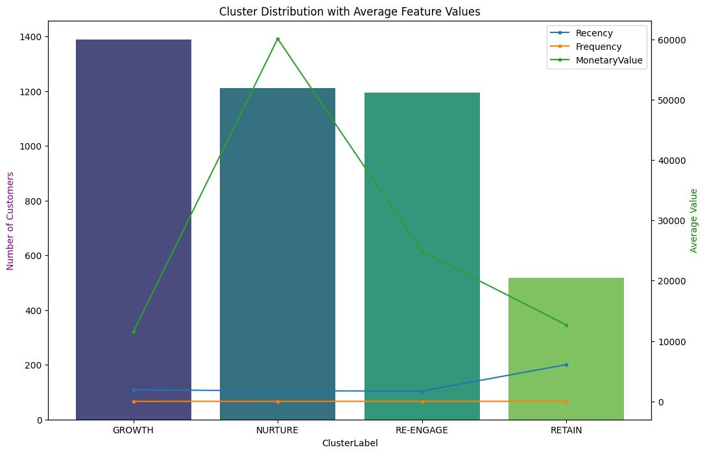
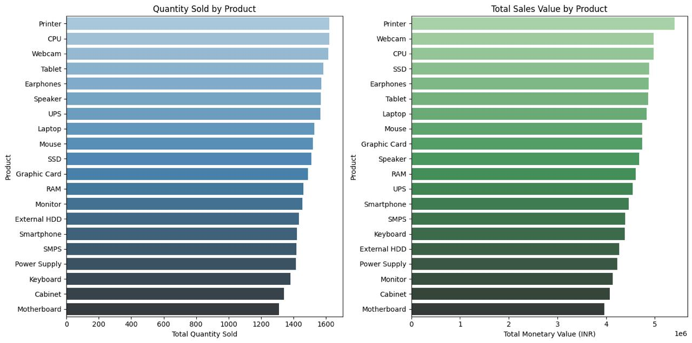

# 🛒 ClusterCart — AI-Powered Customer Segmentation using K-Means Clustering

<p align="center">


</p>

---

<p align="center">

<a href="https://aburyanali.github.io/ClusterCart---Customer-Segmentation-using-K-Means/visualization-demo/">
  
</a>

</p>

---

<p align="center">


</p>

---

<p align="center">


</p>

---

# ✨ Overview

ClusterCart is an advanced **Machine Learning & Business Intelligence** project focused on intelligent customer segmentation using:

- 🧠 K-Means Clustering
- 📊 RFM Analysis
- 📈 Exploratory Data Analysis
- ⚙️ Feature Engineering
- 🤖 Behavioral Customer Intelligence

The project transforms raw e-commerce transaction data into meaningful business insights that help organizations understand customer behaviour and optimize strategic decision-making.

---

# 🚀 Why ClusterCart?

Modern businesses generate massive volumes of customer data every second.

However, raw transactional data alone has limited business value.

ClusterCart bridges this gap by applying **Machine Learning** techniques to uncover hidden behavioural patterns and generate actionable intelligence.

### 💡 Business Questions Solved

✅ Who are the highest-value customers?  
✅ Which customers are likely to churn?  
✅ Which users need re-engagement campaigns?  
✅ Which products generate maximum revenue?  
✅ How can businesses personalize marketing strategies?  

---

# ⚡ AI Analytics Pipeline



---

# 🧠 Machine Learning Workflow

<p align="center">


</p>

```text
1️⃣ Data Collection
2️⃣ Data Cleaning & Preprocessing
3️⃣ Exploratory Data Analysis
4️⃣ RFM Feature Engineering
5️⃣ Feature Scaling
6️⃣ K-Means Clustering
7️⃣ Optimal Cluster Selection
8️⃣ Cluster Evaluation
9️⃣ Visualization & Business Intelligence
```

---

# 📊 RFM Feature Distribution Analysis

<p align="center">
  
</p>

The RFM model analyzes customer behaviour using:

| Metric | Meaning |
|---|---|
| 🕒 Recency | How recently a customer purchased |
| 🔁 Frequency | How often the customer purchases |
| 💰 Monetary | Total spending value |

### 🔍 Insights Extracted

- High-value spending clusters identified
- Purchase frequency behaviour analyzed
- Customer retention opportunities discovered
- Spending distribution trends visualized

---

# 📈 Elbow Method & Silhouette Analysis

<p align="center">
  
</p>

To determine the optimal number of customer clusters, the project applies:

### 🔹 Elbow Method
Detects the point of diminishing returns in clustering performance.

### 🔹 Silhouette Score
Measures clustering quality and separation between clusters.

### 🎯 Result

The clustering pipeline achieved stable segmentation with clear behavioural separation.

---

# 🌐 3D Customer Cluster Visualization

<p align="center">
  
</p>

This 3D scatter visualization demonstrates customer segmentation based on:

- 💰 Monetary Value
- 🔁 Purchase Frequency
- 🕒 Customer Recency

### 🔍 Key Insights

- 💎 Loyal high-value customers
- 🚀 Growth-oriented users
- 🔄 Re-engagement opportunities
- ⚠️ Potential churn customers

---

# 📉 Cluster Analysis & Business Intelligence

<p align="center">
  
</p>

The clusters were translated into business-friendly customer groups:

| Segment | Description |
|---|---|
| 🚀 Growth | Increasing engagement customers |
| 🌱 Nurture | Moderate users with future potential |
| 🔄 Re-Engage | Inactive users needing campaigns |
| 💎 Retain | Loyal high-value customers |

---

# 🛍️ Product Sales Analytics

<p align="center">
  
</p>

The project also performs product-level analytics to identify:

✅ Top-selling products  
✅ High-revenue categories  
✅ Product demand trends  
✅ Sales distribution patterns  

---

# 🛠️ Tech Stack

<p align="center">


</p>

## 👨‍💻 Languages & Libraries

- Python
- NumPy
- Pandas
- scikit-learn
- Matplotlib
- Seaborn

## 🤖 Machine Learning

- K-Means Clustering
- RFM Analysis
- Feature Scaling
- Silhouette Evaluation

## ⚙️ Development Tools

- Jupyter Notebook
- Google Colab
- Git & GitHub

---

# 📂 Project Structure

```bash
ClusterCart---Customer-Segmentation-using-K-Means/
│
├── assets/
│   ├── rfm-distribution.png.jpeg
│   ├── elbow-silhouette.png.jpeg
│   ├── 3d-clusters.png.jpeg
│   ├── cluster-analysis.png.jpeg
│   └── product-sales.png.jpeg
│
├── data_clustering.ipynb
├── indian_electronics_purchases.xlsx
└── README.md
```

---

# 📌 Real-World Applications

🚀 SaaS Analytics Platforms  
🚀 AI-powered CRM Systems  
🚀 Customer Intelligence Engines  
🚀 E-commerce Recommendation Systems  
🚀 Marketing Automation Platforms  
🚀 Business Intelligence Dashboards  

---

# 🔮 Future Improvements

- 🌐 Streamlit Dashboard Deployment
- ⚛️ React.js Frontend Integration
- ⚡ FastAPI Backend APIs
- ☁️ AWS / Azure / GCP Deployment
- 🤖 AI Recommendation Engine
- 📡 Real-time Customer Segmentation
- 📉 Predictive Churn Analysis
- 📊 Interactive BI Dashboard

---

# 👨‍💻 Author

## Abu Ryan Ali

AI/ML Engineer • Software Developer • Data Science Enthusiast

<p align="center">

<a href="https://github.com/aburyanali">
  
</a>

<a href="https://linkedin.com/in/abu-ryan-ali">
  
</a>

</p>

---

# ⭐ Support the Project

If you found this project useful, consider giving it a ⭐ on GitHub.

It helps support future development and motivates further improvements.

---

# 🛒 Powered by Intelligent Customer Analytics

<p align="center">


</p>

---

<p align="center">


</p>

